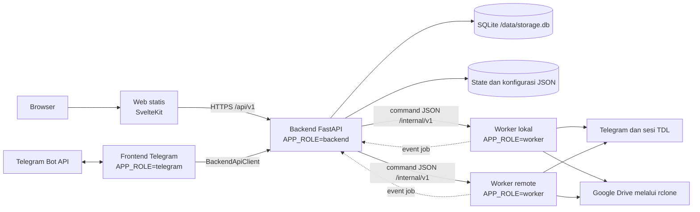
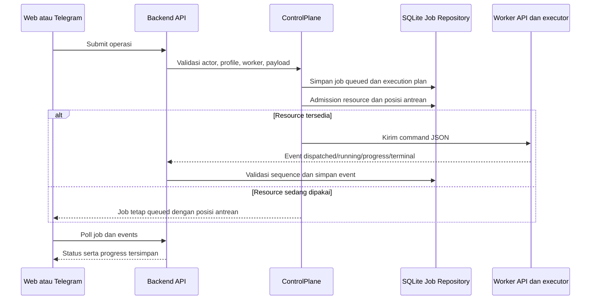
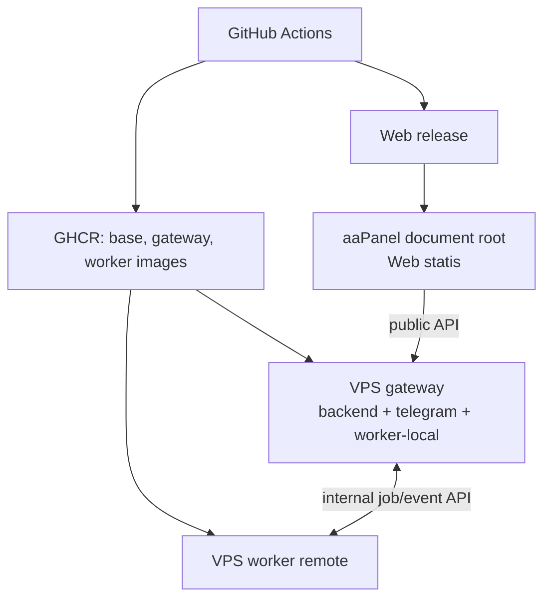

# Arsitektur Sistem tme3bot

Panduan ini menjelaskan susunan komponen, batas tanggung jawab, aliran job,
penyimpanan, keamanan, dan deployment tme3bot untuk maintainer dan developer.

Status di bawah diverifikasi terhadap source pada branch `main`, commit
`a6730b3`, tanggal 26 September 2026. Source code adalah acuan utama jika
perilaku implementasi berubah.

## Gambaran sistem

tme3bot memisahkan antarmuka, control plane, dan eksekusi job. Web dan bot
Telegram meminta operasi melalui backend. Backend memvalidasi actor dan target,
menyimpan lifecycle job, lalu mengirim command JSON ke worker yang dipilih.
Worker menjalankan operasi pada sesi dan filesystem miliknya, kemudian
mengirim event progress kembali ke backend.

Web dibangun sebagai aset statis dan dilayani terpisah dari container backend.
Di production, release Web dipasang ke document root aaPanel. Tidak ada Node.js
runtime atau container Web di VPS tersebut.

## Komponen dan tanggung jawab

| Komponen | Tanggung jawab |
|---|---|
| Web (`web/src`) | Halaman SvelteKit untuk Quick Mode, export, download, storage, utility, worker, dan activity. `lib/api.ts` memanggil public API backend. |
| Frontend Telegram (`tme3bot/frontend/telegram`) | Polling Bot API, keyboard, panel, input user, dan penyajian status. Akses domain dilakukan melalui `BackendApiClient`. |
| Backend API (`tme3bot/api/backend.py`) | Public API, endpoint internal, otorisasi, pemilihan target, katalog, dan pemetaan model ke response API. |
| Control plane (`tme3bot/application/control_plane.py`) | Use case job, lifecycle, retry/cancel, admission resource, dispatch ke worker, serta pemrosesan event. |
| Domain (`tme3bot/domain`) | Model actor/job/event, error domain, status, dan aturan transisi job. |
| Infrastructure (`tme3bot/infrastructure`) | Repository SQLite, auth, dan adapter HTTP untuk komunikasi dengan worker. |
| Worker (`tme3bot/worker`) | API internal, antrean resource lokal, executor job, progress/event publisher, dan operasi domain tanpa dependency UI Telegram. |
| Runtime dan service | `profiles.py` membangun runtime sesi per profile; `service.py`, `tdl.py`, `utility.py`, `rclone.py`, dan modul terkait mengerjakan operasi spesifik. |
| Composition (`tme3bot/app.py`, `tme3bot/composition.py`) | Memilih dan menyambungkan dependency untuk role `backend`, `telegram`, atau `worker`. |

Alur utama pembuatan job:

Job memiliki status `queued`, `dispatched`, `running`, lalu status terminal
`succeeded`, `failed`, atau `cancelled`. Backend merupakan sumber kebenaran
untuk status yang dibaca UI. Worker menerbitkan event idempotent dengan pasangan
`job_id + sequence`; UI melakukan polling public API, bukan membaca worker
langsung.

Admission berjalan pada dua lapisan: backend menyimpan execution plan dan
resource lease lintas worker, sedangkan worker menjalankan `ResourceAwareQueue`
untuk konflik resource di proses worker tersebut. Resource key digunakan untuk
menserialkan akses yang berbagi sesi TDL, artifact, atau area workspace. Job
menyimpan profile dan worker asal saat dibuat; perubahan route hanya berpengaruh
pada job baru.

## Data, sesi, dan batas keamanan

| Data | Lokasi / pemilik | Catatan |
|---|---|---|
| Job, events, execution plan, command internal, auth, dan katalog storage/export | SQLite backend di `/data/storage.db` | Repository job dan katalog dibangun dari file database yang sama. Payload public dirahasiakan sesuai jenis job. |
| State profile, source, dan konfigurasi operasional | File JSON di volume `/data` | Termasuk identity, registry worker (`workers.json`), route profile-worker, label, folder utility, dan settings. Credential tetap berada di konfigurasi runtime; jangan salin nilainya ke log atau dokumen. |
| Sesi TDL | Volume `/data` milik setiap worker, per profile | `user1` dipakai jalur export/leave dan `root` untuk download. Sesi tidak disalin lintas VPS. |
| Workspace | Host mount `/workspace` pada worker | Dipakai utility dan Quick Mode; filesystem worker yang dipilih menentukan workspace yang dikerjakan. |
| Staging Quick Mode | `/workspace/quickmode/<stage_job_id>/` pada worker | Manifest `quickmode.json` dan `worker.log` menyertai JSON/media, thumbnail, serta archive agar retry/recovery dapat melanjutkan pekerjaan. |

Quick Mode menggunakan sesi `.tdl` terisolasi per stage. Pipeline-nya mencakup
export JSON, download media, pembuatan thumbnail, kompresi, upload ke channel
storage, upload archive ke Google Drive melalui rclone, verifikasi, lalu cleanup.
Jika terjadi kegagalan atau upload belum terverifikasi, staging dipertahankan
untuk diagnosis dan recovery. Job terminal sendiri bukan alasan untuk menghapus
staging.

Batas kepercayaan utama:

- Browser memakai sesi autentikasi Web untuk public API; user dan profile
  diverifikasi di backend.
- Frontend Telegram hanya menjadi adapter Bot API dan meneruskan operasi domain
  ke backend melalui client internalnya.
- Backend dan worker berkomunikasi melalui `/internal/v1` dengan bearer token
  internal. Token worker dan internal tidak boleh dikirim ke browser.
- Worker mengelola sesi TDL dan filesystem lokalnya sendiri. Jangan membuka
  database Bolt sesi `.tdl` yang sama dari proses bersamaan.
- Endpoint management memakai credential terpisah. Password utility, cookie
  secret, token, file konfigurasi rahasia, dan isi sesi tidak boleh masuk ke
  telemetry maupun response public.

## Deployment dan pengembangan

Image base, gateway, dan worker dipublish oleh workflow Docker ke GHCR.
Gateway menjalankan backend, frontend Telegram, dan worker lokal; setiap VPS
tambahan menjalankan worker sendiri. Web dipublish sebagai release statis dan
dideploy terpisah. Langkah deployment serta rollback rinci ada di
[`DEPLOYMENT_RUNBOOK.md`](../DEPLOYMENT_RUNBOOK.md).

Untuk perubahan backend/worker, batas yang paling penting dijaga adalah worker
tidak mengimpor UI Telegram/FastAPI, dan frontend Telegram tidak mengakses
runtime domain secara langsung. Test batas arsitektur tersedia di
`tests/test_architecture_boundaries.py`; test domain, API, worker, dan UI
berada di direktori `tests/` serta `web/src`.

## Rekomendasi perbaikan

Rekomendasi ini belum menjadi fitur atau refactor yang tersedia di source pada
commit yang dicatat di atas.

### Prioritas 1 — Kendali concurrency Quick Mode

Quick Mode memakai sesi dan staging terpisah per job, sehingga resource key
stage yang unik memungkinkan banyak pipeline menghabiskan CPU bersamaan.
Tambahkan limit aktif yang dapat diatur per worker, antrean FIFO, serta aksi
pause/resume di monitor. Pause harus menahan proses milik job itu saja tanpa
menghentikan heartbeat worker, membebaskan slot concurrency, dan mengecualikan
waktu jeda dari watchdog stall. Kelola resource lease terpisah: job lain tidak
boleh memakai sesi atau folder eksklusif yang masih ditahan job paused. Bila
worker restart, proses yang dibekukan sudah hilang; Resume harus memakai recovery
fase dari manifest dan mengulang verifikasi yang diperlukan sebelum melanjutkan.
Ini menjawab langsung risiko CPU dari banyak job yang berjalan bersamaan.

### Prioritas 2 — Pecah modul orkestrasi besar

`tme3bot/api/backend.py` dan `tme3bot/worker/executor.py` memuat banyak tanggung
jawab dalam satu file. Pindahkan route dan handler per fitur ke modul terpisah,
pertahankan `composition.py` sebagai wiring, serta gunakan port dan test yang
ada untuk menjaga batas domain/application/infrastructure. Kerjakan bertahap
agar perubahan mudah direview dan regresi dapat dilokalisasi.

### Prioritas 3 — Kontrak backend-worker

Job JSON, event sequence, cancellation, capability, dan response internal adalah
kontrak lintas proses sekaligus lintas release. Tambahkan contract test untuk
payload dan event utama, lalu formalkan pemeriksaan capability/kompatibilitas
saat worker didaftarkan atau backend mengirim job. Ini mengurangi risiko deploy
backend dan worker dengan kontrak yang berbeda.

### Prioritas 4 — Observabilitas antrean dan progress

Catat dan tampilkan waktu tunggu antrean, job aktif per worker, durasi per fase,
latensi event, serta status worker. Kaitkan semua metrik dengan `job_id` dan
stage ID tanpa memasukkan credential. Pemeriksaan progress perlu memastikan
callback transfer hanya memperbarui job pemilik transfer, terutama saat beberapa
Quick Mode berlangsung bersamaan.

## Peta source untuk mulai menelusuri

- Composition dan role runtime: `tme3bot/app.py`, `tme3bot/composition.py`.
- Lifecycle, admission, dispatch, dan event job:
  `tme3bot/application/control_plane.py`,
  `tme3bot/application/job_scheduler.py`,
  `tme3bot/infrastructure/job_store.py`.
- API worker dan eksekusi job: `tme3bot/api/worker.py`,
  `tme3bot/worker/executor.py`.
- Kontrak domain dan integrasi frontend: `tme3bot/domain/models.py`,
  `tme3bot/api/backend.py`, `tme3bot/frontend/client.py`, `web/src/lib/api.ts`.
