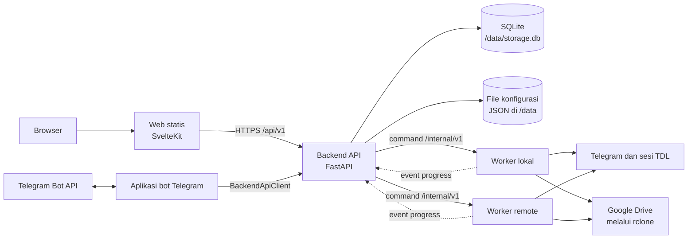
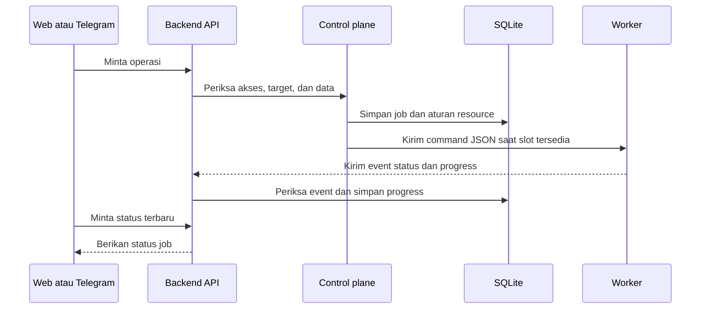
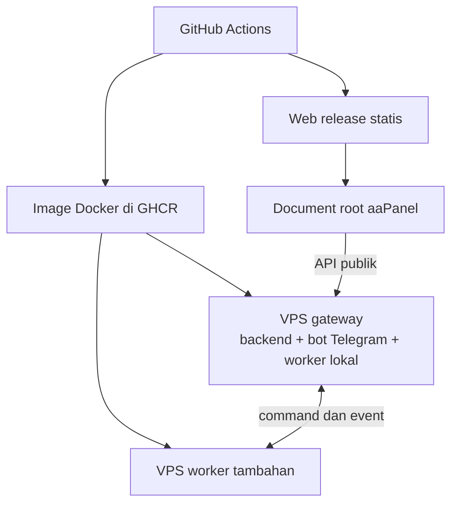

# Arsitektur Sistem tme3bot

Dokumen ini menjelaskan bagian utama tme3bot, alur job, data yang disimpan,
serta pengembangan yang disarankan. Peta ini diperiksa terhadap source dan
perubahan working tree pada 27 September 2026. Jika dokumen dan source berbeda,
ikuti source.

## Ringkasan

tme3bot punya tiga bagian utama: antarmuka, backend, dan worker. Web dan bot
Telegram mengirim permintaan ke backend. Backend memeriksa akses, menyimpan
job, lalu memilih worker. Worker menjalankan tugas dan mengirim status serta
progress kembali ke backend.

Web dipasang sebagai file statis di aaPanel. Backend dan worker berjalan di
Docker. Worker lokal berjalan bersama backend di VPS gateway; worker lain dapat
berjalan di VPS terpisah.

## Bagian sistem



| Bagian | Tugas utama | Source utama |
|---|---|---|
| Web | Menampilkan Quick Mode, export, download, storage, utility, worker, dan activity. | `web/src/` |
| Bot Telegram | Menangani pesan, tombol, dan input Telegram. Data job tetap diminta dari backend. | `tme3bot/frontend/telegram/` |
| Backend API | Memeriksa user dan target, menyediakan API, menyimpan job, dan memilih worker. | `tme3bot/api/` |
| Control plane | Mengatur antrean, lifecycle job, retry, pause/resume, dispatch, dan event. | `tme3bot/application/control_plane.py` |
| Domain | Menyimpan model job, actor, event, status, dan aturan perubahan status. | `tme3bot/domain/` |
| Infrastructure | Menghubungkan aplikasi ke SQLite, autentikasi, dan API worker. | `tme3bot/infrastructure/` |
| Worker | Menjalankan export, download, Quick Mode, utility, storage, backup, dan workspace. | `tme3bot/worker/` |
| Runtime | Membuka sesi per profile dan menjalankan TDL, rclone, serta utility. | `profiles.py`, `service.py`, `tdl.py`, `rclone.py`, `utility.py` |

`app.py` dan `composition.py` menyusun dependency sesuai role aplikasi:
`backend`, `telegram`, atau `worker`. Worker tidak bergantung pada tampilan Web
atau Telegram.

## Alur job



Status job yang disimpan backend adalah sumber status untuk UI. Job biasanya
bergerak dari `queued` ke `dispatched`, lalu `running`, dan berakhir sebagai
`succeeded`, `failed`, atau `cancelled`. UI membaca status dari backend; UI
tidak membaca database worker.

Setiap event membawa `job_id` dan nomor `sequence`. Backend menolak nomor lama
atau event dari worker yang tidak sesuai dengan worker pemilik job. Worker juga
mengirim waktu kirim event agar backend dapat mengukur keterlambatan progress.

## Antrean dan kerja bersamaan

Backend menyimpan rencana eksekusi dan mengatur slot lintas worker. Di worker,
`ResourceAwareQueue` menjalankan beberapa job sekaligus jika job itu tidak
memakai resource yang sama. Resource dapat berupa sesi TDL, profile, folder,
atau folder staging.

Aturan yang berlaku:

- Download untuk profile dan worker asal yang sama berjalan berurutan. Asal
  yang berbeda dapat berjalan bersamaan.
- Utility untuk folder yang sama berjalan berurutan. Folder yang berbeda dapat
  berjalan bersamaan.
- Export memakai lane profile-worker. Quick Mode punya batas job aktif per
  worker yang dapat diatur dari Quick Mode Manager.
- Storage upload berjalan berurutan pada worker yang sama.
- Jangan membuka database sesi `.tdl` yang sama dari dua proses bersamaan.
- Job tetap terikat pada profile dan worker saat dibuat. Mengubah route hanya
  berpengaruh pada job baru.

Quick Mode secara default membatasi dua job aktif per worker. Batas dapat
diubah dari 1 sampai 32. Job profile berbeda boleh memakai slot worker yang
tersedia. Pause menghentikan proses job dan melepas slot concurrency, tetapi
resource eksklusif yang masih dibutuhkan job tetap ditahan. Resume memasukkan
job kembali ke antrean dan melanjutkan dari staging yang sama.

## Quick Mode dan folder staging

Setiap rangkaian Quick Mode memakai foldernya sendiri di worker:

```text
/workspace/quickmode/<stage_job_id>/
```

Folder dapat berisi JSON export, media, thumbnail, archive, `quickmode.json`,
`worker.log`, dan sesi `.tdl` khusus stage tersebut. Manifest menyimpan data
yang dibutuhkan untuk melanjutkan job setelah gagal atau di-retry.

Alur Quick Mode adalah export, download media, buat thumbnail, kompres, upload
ke Telegram dan Google Drive, lalu verifikasi. Jika job gagal atau upload belum
lolos verifikasi, folder staging dipertahankan untuk diagnosis dan recovery.
Job yang berstatus terminal tidak otomatis berarti foldernya aman dihapus.

Quick Mode Manager dapat memindai folder di setiap worker dan menjalankan
recovery. Operator juga dapat menghapus folder staging yang tidak sedang dipakai
job, antrean, atau verifikasi. Penghapusan ini menghapus semua file fisik,
termasuk `quickmode.json`, `worker.log`, media, archive, dan sesi `.tdl`. Riwayat
job di backend tetap ada.

API utama Quick Mode:

- `GET /api/v1/quick-mode/staging` memindai folder staging.
- `POST /api/v1/quick-mode/recover` memasukkan staging kembali ke antrean.
- `DELETE /api/v1/quick-mode/staging/{worker}/{stage_job_id}` menghapus folder
  staging yang tidak aktif.
- `GET /api/v1/quick-mode/limits` membaca batas job aktif; `PUT
  /api/v1/quick-mode/limits/{worker}` mengubah batas untuk satu worker.
- `GET /api/v1/jobs/metrics` memberi ringkasan antrean dan status worker.

## Data dan keamanan

| Data | Disimpan di | Catatan |
|---|---|---|
| Job, event, antrean, autentikasi, katalog export dan storage | SQLite backend, `/data/storage.db` | Menyimpan lifecycle job dan progress yang dibaca UI. |
| Identity, profile, source, route worker, label, dan pengaturan | File JSON di `/data` | Credential dan token tidak boleh ditulis ke log atau dikirim ke Web. |
| Sesi TDL | Volume `/data` pada masing-masing worker | `user1` untuk export/leave; `root` untuk download. Sesi tidak disalin ke worker lain. |
| File kerja dan staging | Workspace worker, `/workspace` | Operasi berjalan pada filesystem worker yang dipilih. |

Backend menentukan profile dari identity user dan memeriksa hak akses setiap
permintaan. Browser menggunakan sesi Web untuk API publik. Backend dan worker
memakai bearer token internal; token itu tidak pernah dikirim ke browser.

Worker hanya menerima operasi folder yang divalidasi sebagai bagian dari
`/workspace`. Backend menjadi tempat pengambilan source dan status bersama.
Jangan membaca file sesi `.tdl`, token, password utility, atau file environment
ke dalam log maupun dokumentasi.

## Komunikasi backend dan worker

Worker mengiklankan versi API serta daftar kemampuan di
`GET /internal/v1/capabilities`. Backend memeriksa kemampuan itu sebelum
mengirim operasi yang membutuhkannya. Contohnya, worker lama yang belum
mendukung hapus staging ditolak dengan error kompatibilitas yang jelas.

Command dikirim sebagai JSON melalui `/internal/v1`. Event job dikirim kembali
ke backend melalui API internal. Contract test menjaga bentuk command, nomor
event, dan pemeriksaan versi/kemampuan worker.

## Deployment dan source map



Web tidak membutuhkan Node.js atau container Web saat berjalan di production.
Web dipasang terpisah ke aaPanel. Gateway dan worker memakai image Docker dari
GHCR. Cara deploy dan rollback ada di
[`DEPLOYMENT_RUNBOOK.md`](../DEPLOYMENT_RUNBOOK.md).

Untuk menelusuri source:

- Role dan dependency: `tme3bot/app.py`, `tme3bot/composition.py`.
- Job, antrean, dan lifecycle: `tme3bot/application/control_plane.py`,
  `tme3bot/application/job_scheduler.py`, `tme3bot/infrastructure/job_store.py`.
- Public API: `tme3bot/api/backend.py`, `tme3bot/api/routes/`.
- Worker API dan eksekusi: `tme3bot/api/worker.py`,
  `tme3bot/worker/executor.py`, `tme3bot/worker/executor_*.py`.
- API Web: `web/src/lib/api.ts`; UI Quick Mode:
  `web/src/lib/components/QuickModePage.svelte`.
- Batas arsitektur: `tests/test_architecture_boundaries.py`.

## Yang sudah diterapkan

1. Quick Mode punya batas kerja bersamaan per worker, antrean, Pause, dan
   Resume.
2. Backend API dan executor worker sudah dipisah ke route dan modul fitur.
3. Backend dan worker memakai versi serta daftar kemampuan API internal.
4. Monitor menampilkan antrean, waktu tunggu, status worker, latency event, dan
   durasi fase job.
5. Quick Mode Manager dapat menghapus staging yang tidak aktif dengan
   konfirmasi. Penghapusan folder tidak menghapus riwayat job.

## Rekomendasi berikutnya

### 1. Simpan audit penghapusan staging

Saat ini folder fisik dapat dihapus, tetapi riwayat job tidak mencatat siapa
yang menghapus staging dan kapan. Simpan audit berisi actor, worker, stage ID,
waktu, dan hasil penghapusan. Ini akan membantu menjawab pertanyaan “mengapa
folder recovery sudah tidak ada?” tanpa menyimpan isi file yang dihapus.

### 2. Perkuat recovery setelah worker restart

Job dan payload tersimpan di SQLite backend, tetapi antrean lokal worker berada
di memori proses. Backend membatalkan job aktif yang lama tidak mengirim progress;
belum ada proses umum untuk mengirim ulang command yang mungkin hilang saat
worker restart. Tambahkan lease dispatch dan rekonsiliasi: backend dapat
membedakan job yang masih berjalan dari job yang belum diterima worker, lalu
mengirim ulang command secara aman dengan ID job yang sama.

### 3. Pantau kapasitas worker dan staging

Monitor sekarang menjelaskan antrean dan ketepatan progress job. Tambahkan
penggunaan CPU, memori, ruang disk workspace, dan ukuran staging per worker.
Berikan peringatan untuk worker yang lama tidak merespons, antrean yang terlalu
lama, serta workspace yang hampir penuh. Ini akan membantu mencegah beban CPU
berlebih dan kegagalan karena disk penuh.
