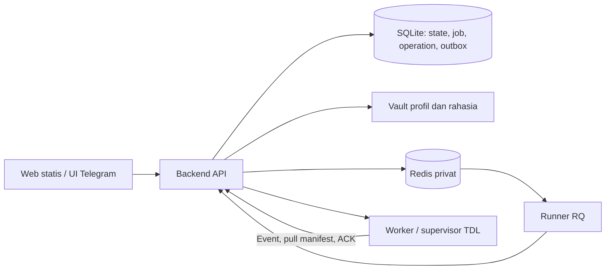

# Rencana pemisahan backend, worker, dan Web

## Cara memakai paket

Paket ini berisi 28 dokumen dengan 24 task implementasi (P0, P1, dan 01–22). Status dan hasil task aplikasi tercatat di [PROGRESS](PROGRESS.md).
Agent pelaksana cukup membaca overview ini dan satu file task yang ditugaskan.
Kerjakan [P0 — akses laptop tepercaya](00-PRIORITY-trusted-device-access.md) sebelum 01. Kerjakan [P1 — diagnosis dan pemulihan kesiapan TTS](03A-PRIORITY-tts-health-recovery.md) sesudah 03 dan sebelum 04; P1 tidak memerlukan Redis.
Rekomendasi tambahan di [RECOMMENDATIONS](RECOMMENDATIONS.md), keputusan bersyarat di [OPEN-QUESTIONS](OPEN-QUESTIONS.md).
Semua path source dalam task relatif terhadap root repository. Bahasa dokumentasi Indonesia.

## Baseline audit — 2026-10-04, Asia/Jakarta

Branch `main`, HEAD `c5c76b3` (sinkron profil); verifikasi ulang dengan git sebelum bekerja.
Worktree sudah berubah pada backend.py, http_client.py, profile_provisioning.py, worker/executor.py, worker/profile_sessions.py, ProfilesPage.svelte, test terkait dan graphify-out/.
Perubahan itu mencakup refresh manual, provisioning, default/adopsi dan lock sesi; jangan dibatalkan atau dianggap sudah deploy.
Tidak ada akses/test production pada penyusunan paket ini. Keadaan deployment terbaru tidak ditemukan/ambigu.

| Area | Fakta source dan bukti |
|---|---|
| Stack/startup | SvelteKit static + FastAPI/Python 3.10; role melalui `tme3bot/app.py`, `composition.py`. `Dockerfile`/`Dockerfile.base`, Compose gateway/worker; tidak ada server Node Web produksi. |
| Backend | `api/backend.py` control plane, `application/control_plane.py` lifecycle, `infrastructure/job_store.py` SQLite, `frontend/client.py` client Telegram. |
| Source | `profiles.py:build_profile_runtime` memilih `state.py:HttpStateStore` pada worker; backend memakai StateStore JSON dengan cache/RLock. Source mengikuti profile, bukan label. |
| Data lama | Layout default /data, profil lain /data/profiles/name; `backup_service.py` masih membawa state lama. File worker bukan otomatis state terbaru. |
| Profil | `profile_provisioning.py` vault AES-GCM + tabel distribusi; `worker/executor.py:sync_profiles` mengirim identity lokal, belum pull revision. |
| TDL/QR | `tdl.py` subprocess/PTY; `worker/profile_sessions.py` menyimpan proses login dalam memori, state() turut membaca PTY/menyelesaikan validasi. |
| Queue | Job persisten tetapi `profile_queue.py` antrean memori; submit ControlPlane masih dispatch. GET login dapat memicu fase validating. |
| Web | Polling di JobTable, QuickModePage, ExportPage, Login; Profiles punya perubahan lokal refresh manual. `web/package.json`: pnpm check/test/build. |
| Settings | `backend_runtime_settings.py` dan `worker/runtime_settings.py` sudah sebagian dinamis; PUT worker masih RPC. `config.py` memerlukan BOT_TOKEN sebelum bootstrap persisten. |
| ENV | Inventaris lengkap 153 nama/pembaca/kategori di lampiran task 21; termasuk helper/proxy/build. Parser-only dan consumer tidak ditemukan ditandai. |

## Arsitektur target

Backend adalah pemilik state/profile/config. Runner hanya memakai API internal; tidak mount DB/vault.
Worker menyimpan sesi salinan, artifact, journal/outbox dan checkpoint operasional. Channel/last_id hanya di backend.
root/.tdl dan user1/.tdl tetap terpisah; backend tidak menjalankan TDL. Web tidak mengendalikan kelangsungan proses.

## Keputusan dan kontrak bersama

- P0: key Ed25519 laptop disetujui sekali melalui Pengaturan; helper Windows/DPAPI membuat sesi agent tanpa bot, dengan izin actor yang sama.
- Trust perangkat berlaku sampai dicabut; sesi tetap expired/refresh. Revoke memutus semua sesi device; login Telegram dan device tidak saling mengeluarkan.
- Helper/state browser hanya dipakai untuk pekerjaan production yang sudah diotorisasi; tidak ada akses otomatis berdasarkan MAC/IP atau token di URL.

- SQLite backend tetap sumber kebenaran; Redis + RQ untuk orkestrasi singkat. Remote worker tetap HTTP, tanpa Redis.
- Job/operation/plan/outbox harus commit satu transaksi; 202 berarti tersimpan, bukan pekerjaan selesai.
- Pengiriman at least once memakai command_id, attempt, dispatch_token/fencing dan event sequence. Tidak menjanjikan exactly once untuk efek eksternal.
- POST /api/v1/operations memakai allowlist kind, target, input dan Idempotency-Key; GET daftar/status hanya snapshot actor yang berhak.
- DTO publik: operation_id, kind, status, phase, revision, target metadata, progress, job_id opsional, timestamp, error tersanitasi dan status_url. Payload privat tidak dikembalikan.
- Operation status: queued/running/waiting_user/waiting_worker/paused/needs_reconciliation/cancelling/succeeded/failed/cancelled. Dismissed adalah preferensi tampilan.
- Retry tetap operation ID sama dengan attempt baru; job yang sudah ditempatkan tetap pada origin worker. Duplicate submit memakai ID sama.
- Lease hilang heartbeat tidak langsung bebas. Side effect tidak pasti perlu reconciliation; checkpoint aman dapat dilanjutkan.
- Source memakai profile + peer_type/peer_id terverifikasi. Alias belum resolve menunggu; label tidak memisahkan cursor.
- Export profile-channel sama serial lintas worker; baca cursor saat lease diberikan. Start manual tidak menurunkan cursor.
- QuickMode melepas export lane sesudah cursor+artifact commit; fase download/compress/upload tetap memakai limit lama.
- Worker mengambil manifest saat startup dan manual sync; hanya download revisi hilang/berubah. Repair revision sama harus eksplisit.
- Vault tidak otomatis menerima perubahan sesi worker. Upload/login/adopsi/snapshot eksplisit menghasilkan revisi resmi.
- Default ikut vault dan distribusi. Profil baru aktif sesudah semua target awal ACK, termasuk offline/disabled; worker baru menunggu sync lokal.
- GET login tidak memicu transisi. Supervisor berjalan tanpa browser; URL memilih operation ID yang sama saat dibuka kembali.
- QR expired atau proses restart memerlukan renew manual, attempt baru. Jangan menyimpan/replay OTP/2FA atau menampilkan QR pada API daftar.
- Upload belum selesai HTTP tidak dijanjikan survive; sesudah accepted seluruh workflow berjalan background.
- Polling browser hanya monitor progress aktif terlihat, 2500ms dasar, tanpa overlap, backoff sampai 30s. Waiting/queued/paused/settings/inventory manual refresh.
- Heartbeat, retry dan rekonsiliasi internal tetap berjalan; jangan menyamakan loop tersebut dengan polling browser.
- Desired settings disimpan walau worker offline/busy; apply saat aman, ACK per versi. Job memakai snapshot config.
- ENV runtime diimpor sekali, persisted wins, clear memakai tombstone. Rahasia encrypted/redacted; trust bootstrap tetap persisten.
- TTS tetap dikirim melalui akun TDL profil aktif. Nama legacy TELEGRAM_TTS_CHAT_ID tidak mengembalikan pengiriman Bot API.
- P1 menyediakan diagnosis per helper dan recovery Tor yang dipicu operator dari Workers Web tanpa Docker socket. Task berikutnya boleh mengubah implementasinya, tetapi wajib mempertahankan diagnosis, aksi recovery terbatas, auth, dan refresh manual; helper container yang tidak merespons tetap membutuhkan supervisor/operator host.
- Static Web, auth actor/worker, batas /workspace dan aturan artifact missing tetap dipertahankan.

## Gerbang kompatibilitas dan migrasi

Metadata backend menyimpan backend_source_state, durable_dispatch per worker dan shared_export_cursor; default nonaktif saat upgrade.
Capability operations_v1, durable_commands_v1, shared_export_cursor_v1, profile_pull_v1 dan runtime_settings_v1 menentukan kesiapan.
Schema/endpoint additive dipasang dahulu; jalur lama tetap tersedia sampai backend, worker dan Web kompatibel.
Task worker hanya mengiklankan capability setelah readiness nyata. Jangan menerapkan gate via ENV tambahan.

1. Backup konsisten DB, vault, key dan snapshot state lama; catat jobs aktif serta checksum.
2. Inventaris/dry-run migrasi: backend kandidat utama; worker lebih tinggi harus memiliki bukti export. Konflik tidak dipilih lewat max(last_id).
3. Tahan admission channel konflik; selesaikan keputusan operator. Drain export sebelum import final, cek revision/checksum, simpan ledger idempotent.
4. Canary worker: pull revision, ACK, uji cursor bersama/queue/login/settings; aktifkan gate bertahap lalu publish Web.
5. Setelah seluruh worker kompatibel, matikan penulis/fallback lama; archive state worker sesudah receipt/verifikasi. Checkpoint/artifact tetap dipertahankan.
6. Rollback: hentikan admission, drain/reconcile, simpan outbox accepted, ekspor cursor terbaru ke format lama. Jangan restore DB lama di atas progress baru.
7. Produksi membutuhkan langkah operator tersendiri; paket task ini tidak memberikan instruksi auto-deploy dari agent.

## Aturan agent pelaksana

- Kerjakan **satu task per sesi**. Verifikasi prerequisite dari PROGRESS dan source, bukan ingatan percakapan.
- Baca git status/log/diff; pertahankan perubahan lokal. Tidak ada reset/clean massal atau commit/deploy otomatis.
- Allowlist file dalam task bersifat lengkap. Modul baru ditentukan namanya; backend.py hanya wiring logika baru.
- Jangan memperluas allowlist diam-diam. Jika prasyarat/kontrak tidak sesuai, catat task terblokir beserta bukti.
- Jangan menghapus atau melemahkan kontrak P1 saat refactor worker, settings, queue, atau Web. Bila implementasi perlu dipindahkan ke operation background, pertahankan API/UX setara, batas helper yang sama, dan test kontraknya.
- Pakai apply_patch, Python 3.10/Ubuntu 22.04, dataclass/type hints, domain/application/infrastructure dan test unittest yang ada.
- Web memakai Svelte 5/TypeScript, Vitest, adapter static. Jangan menambah Next.js atau container web.
- Data default /data; root untuk download, user1 untuk export/leave; jangan berbagi database Bolt aktif.
- Jangan log nilai secret, isi sesi, ZIP, phone, OTP, 2FA, QR atau text TTS. Public response hanya metadata yang diperlukan.
- Verifikasi per task dengan mock/temporary data; catat hasil nyata, skip/tool tidak tersedia dan baseline failure.
- Source berubah: compileall, test terkait, git diff --check, graphify update .; Web tambah pnpm check/test/build.
- graphify-out/ hanya boleh berubah lewat tool; jangan edit manual. Penyusunan paket dokumentasi ini sendiri hanya menulis plan/ dan tidak menjalankan update.
- Setelah verifikasi, perbarui hanya baris task pada PROGRESS: status, catatan dan tanggal Asia/Jakarta; berhenti setelah satu task.
- Jika rollback task yang sudah menjadi prasyarat task lain, rollback dependennya terlebih dahulu atau gunakan compatibility adapter.

## Urutan dan ketergantungan

| ID | Task | Prasyarat |
|---|---|---|
| P0 | [Akses production dari laptop tepercaya](00-PRIORITY-trusted-device-access.md) | —; prioritas sebelum 01 |
| 01 | [Repository state backend dan pemisahan runtime profil](01-backend-source-state.md) | — |
| 02 | [Inventarisasi dan migrasi state lama tanpa kehilangan progress](02-legacy-state-migration.md) | 01 |
| 03 | [Operation persisten dan transactional outbox](03-durable-operations-outbox.md) | 01 |
| P1 | [Diagnosis dan pemulihan kesiapan helper TTS](03A-PRIORITY-tts-health-recovery.md) | 03; dikerjakan sebelum 04 |
| 04 | [Redis privat dan proses RQ untuk orkestrasi](04-redis-rq-runtime.md) | 03, P1 |
| 05 | [Penerimaan cepat dan kontrak dispatch berversi](05-background-dispatch-contract.md) | 03, 04 |
| 06 | [Alias peer dan serialisasi export lintas worker](06-shared-export-cursor.md) | 01, 05 |
| 07 | [Vault profil berversi dan kontrak tarik/ACK](07-versioned-profile-vault.md) | 03 |
| 08 | [Konfigurasi terpusat, versi penerapan, dan rahasia](08-desired-runtime-settings.md) | 03, P1 |
| 09 | [Jurnal command worker dan outbox event persisten](09-worker-command-journal.md) | P1, 05 |
| 10 | [Tarik profil saat startup dan sinkronisasi manual](10-worker-profile-pull.md) | 07, 09 |
| 11 | [Executor export memakai cursor bersama dan mengarsip state lokal](11-worker-export-state-cutover.md) | 02, 06, 09, 10 |
| 12 | [Supervisor login TDL yang tidak bergantung pada browser](12-worker-login-supervisor.md) | P1, 09, 10 |
| 13 | [Workflow profil upload, login, adopsi, dan distribusi](13-background-profile-provisioning.md) | 07, 12 |
| 14 | [Penerapan konfigurasi worker saat aman](14-worker-settings-apply.md) | P1, 08, 09 |
| 15 | [Bootstrap persisten dan reload client layanan](15-service-settings-reload.md) | P0, 08 |
| 16 | [Aksi Quick Mode sebagai operation background](16-quickmode-background-actions.md) | 05, 09 |
| 17 | [Pemeriksaan Storage, Utility, dan target melalui antrean](17-storage-utility-background-actions.md) | 05, 09 |
| 18 | [Halaman Profil pulih setelah ditutup](18-web-profile-recovery.md) | 10, 13 |
| 19 | [Monitor progress terpusat dan refresh berdasarkan aksi](19-web-operation-monitor.md) | P0, P1, 16, 17, 18 |
| 20 | [Pengaturan Web dengan desired/applied status](20-web-runtime-settings.md) | P0, P1, 14, 15 |
| 21 | [Penyederhanaan ENV dan inventaris pemakaian](21-env-cleanup-and-inventory.md) | 14, 15, 20 |
| 22 | [Uji kegagalan lintas komponen dan panduan cutover](22-integration-and-rollout.md) | P0, P1, 01–21 |
