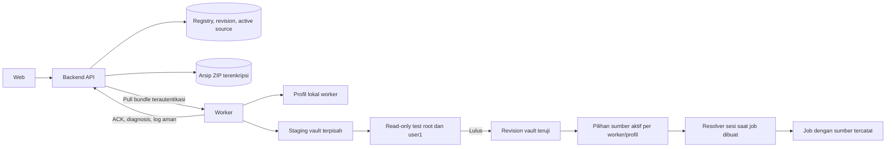

# Perombakan Profil Lokal dan Vault

**Status:** rencana kerja; belum mengubah aplikasi.

**Issue terkait:** [#1 — diagnosis verifikasi akses TDL Storage/TTS](https://github.com/nkurnia1031/dockter_bot_tdl/issues/1) · [#2 — profil Remote-1 tampak siap tetapi sesi tidak terbaca](https://github.com/nkurnia1031/dockter_bot_tdl/issues/2)
**Wayfinder:** [Map perombakan profil](https://github.com/nkurnia1031/dockter_bot_tdl/issues/3) · [Bukti runtime remote-1](https://github.com/nkurnia1031/dockter_bot_tdl/issues/4) · [Inventaris backup lokal](https://github.com/nkurnia1031/dockter_bot_tdl/issues/5)
**Baseline source yang diperiksa:** `main` pada `802ebfd`.

Dokumen ini mengarahkan perombakan penyimpanan dan pemilihan sesi TDL. Profil lokal setiap worker tetap utuh dan menjadi pilihan awal. Vault menjadi salinan alternatif yang dikelola backend; sebuah worker baru boleh menggunakannya setelah kedua sesi TDL lulus pemeriksaan. Adopsi atau kegagalan distribusi tidak boleh mengganti sesi lokal.

## Cara menjalankan pekerjaan dengan skills

Ikuti urutan ini ketika mulai mengerjakan redesign. Jangan melompati keputusan desain untuk langsung mengubah source.

1. **`/ask-matt`** — pilih alur kerja untuk pekerjaan besar dengan keputusan yang masih perlu dipastikan.
2. **`/diagnosing-bugs`** — buat feedback loop yang bisa gagal untuk gejala kedua issue sebelum menetapkan penyebab. Untuk issue #1, hasil harus mengidentifikasi worker, nama profil, sumber sesi, operasi/perintah yang dicoba, dan alasan tiap kandidat gagal. Untuk issue #2, pisahkan bukti ACK vault dari hasil pemeriksaan runtime worker. Jangan menyimpulkan penyebab koneksi `remote-1` tanpa log atau diagnosis yang membuktikannya.
3. **`/wayfinder`** — petakan pekerjaan di GitHub Issues dan hubungkan map dengan issue #1 dan #2 yang sudah ada. Di dalam alur ini gunakan:
   - **`/grilling`** untuk menguji keputusan dan kasus gagal;
   - **`/domain-modeling`** untuk menyepakati istilah local profile, vault profile, revision, active source, dan fallback;
   - **`/codebase-design`** untuk menetapkan seam resolver sumber sesi yang bisa diuji tanpa worker atau TDL nyata.
   Jangan membuat issue duplikat untuk #1/#2. `/triage` tidak dipakai untuk dua issue maintainer ini.
4. **`/to-spec`** — susun spesifikasi sesudah map dan keputusan selesai. Konfirmasikan tiga seam tes di bagian [Seam yang sudah disetujui](#seam-yang-sudah-disetujui); persetujuan untuk seam ini sudah diberikan.
5. **`/to-tickets`** — pecah spesifikasi menjadi tiket vertikal yang masing-masing punya prasyarat, blocker, kriteria selesai, dan rollback.
6. **`/writing-for-agents`** — jaga dokumen ini sebagai indeks keputusan, tahapan, issue, dan skill; tambahkan tautan ke tiket hasil pemetaan tanpa menggandakan spesifikasi.
7. **`/implement`** — kerjakan satu tiket dalam satu sesi. Gunakan **`/tdd`** pada seam yang disepakati, lalu **`/code-review`** terhadap tiket itu. Setelah satu tiket selesai, berhenti dan tunggu arahan; jangan otomatis mengambil tiket berikutnya.
8. **`/retro`** — lakukan setelah rollout dan penerimaan selesai.

## Temuan baseline

- `ProfileSessionManager.install_bundle()` di `tme3bot/worker/profile_sessions.py` memasang isi bundle ke `root/.tdl` dan `user1/.tdl` pada `profile_root` yang sama dengan sesi lokal. Direktori lama dipindah ke backup untuk rollback, tetapi provisioning tetap dapat mengganti sesi lokal.
- `ProfileSessionManager.verify_installed()` memeriksa identity dan file database Bolt yang ada/tidak kosong serta memastikan dua direktori tidak berbagi file yang sama. Pemeriksaan ini sendiri belum membuktikan TDL dapat membuka masing-masing sesi.
- `ProfileSyncClient` di `tme3bot/worker/profile_sync.py` memanggil installer tersebut saat revision berubah. Pemeriksaan revision yang sama juga bergantung pada `verify_installed()`.
- `build_profile_config()` dan `ProfileManager` di `tme3bot/profiles.py` menemukan profil lokal melalui root profil yang dikonfigurasi. Root vault yang terpisah harus berada di luar root pemindaian ini agar vault tidak keliru dianggap profil lokal.
- Issue #2 mencatat bahwa status ACK vault dapat terlihat **Siap** sebelum status runtime worker diperiksa; bukti penyebab khusus `remote-1` belum tersedia. UI dan API harus membedakan ACK backend, sesi terpasang, hasil tes runtime, dan sumber yang aktif.
- Issue #1 membutuhkan hasil diagnosis per profil yang menjelaskan sumber sesi serta operasi yang benar-benar dicoba. Pemeriksaan akses Storage/TTS yang mengirim pesan uji tetap terpisah dari tes kesiapan vault yang harus read-only.

### Diagnosis lokal awal — 2026-10-11

- **Jalur mutasi lokal terbukti.** Harness minimal menyiapkan sesi lokal `root/.tdl`, `user1/.tdl`, dan identity, lalu memanggil `ProfileSessionManager.install_bundle()` untuk nama profil yang sama. Asersi bahwa isi tree lokal tidak berubah gagal pada ketiga percobaan (`local tree changed per attempt: [True, True, True]`). Ini membuktikan installer saat ini menimpa tree sesi lokal; ini belum membuktikan bahwa jalur tersebut adalah penyebab khusus gangguan `remote-1`.
- **Verdict siap dari ACK terbukti.** Harness memanggil `workerSyncMessage()` dari `ProfilesPage.svelte` dengan ACK management `ready` pada revision 4, sementara status runtime worker `unavailable` dan daftar profil runtime kosong. Fungsi tetap menghasilkan `Revision vault 4 sudah terpasang dan dikonfirmasi.` Asersi bahwa ACK saja tidak menyatakan kesiapan runtime gagal.
- **Issue #1 perlu mempertahankan diagnosis yang ada dan menambahkan sumber.** `TdlAccessExecutorMixin._tdl_access_verify()` saat ini menguji nama profil lokal yang ditemukan oleh `ProfileManager`; hasilnya belum dapat membedakan sesi lokal dengan salinan vault sebagai kandidat terpisah.
- **Batas bukti:** tidak ada sesi atau log baru dari `remote-1` yang diperiksa dalam tahap ini. Akar kegagalan TDL di worker tersebut belum diketahui. Percobaan `pnpm exec vitest run src/lib/components/ProfilesPage.test.ts` pada mesin ini tertahan setelah banner `RUN`; proses dihentikan, sehingga bukan hasil lulus atau gagal test suite.

## Model istilah dan kepemilikan

| Istilah | Pemilik | Makna |
|---|---|---|
| Profil lokal | Worker tertentu | Sesi yang sudah ada di worker tersebut. Nama lokal yang sama di dua worker tetap merupakan dua salinan lokal berbeda. |
| Profil vault | Backend | Profil bersama dengan identitas, arsip ZIP terenkripsi, dan revision resmi. |
| Salinan vault worker | Worker tertentu | Revision vault yang sudah diunduh, diekstrak ke root vault terpisah, dan diuji pada worker itu. |
| Identitas profil | Profil | Satu ID numerik Telegram yang berlaku untuk sesi `root` dan `user1`; kedua sesi harus melaporkan ID yang sama. |
| Sumber aktif | Pasangan worker + profil | Pilihan runtime lokal atau vault untuk job baru; identitas sumber aktif menentukan pemetaan actor profil. |
| Siap digunakan | Pasangan worker + profil + sumber | Identitas serta sesi yang benar-benar akan digunakan sudah melewati pemeriksaan runtime yang disyaratkan. ACK saja tidak cukup. |

Nama lokal dan nama vault boleh sama dan harus tampil sebagai dua sumber yang dapat dibedakan. Simpan identitas per sumber; jangan menganggap kesamaan nama berarti kesamaan akun Telegram. Profil lokal menjadi sumber aktif awal bagi profil yang sudah ada.

Backend adalah sumber kebenaran untuk registry vault, identitas vault, revision, arsip terenkripsi, dan pilihan sumber yang diminta operator. Worker memiliki sesi lokal, salinan vault per revision, hasil tes runtime, serta pilihan aktif yang telah diterapkan. Sesi `root/.tdl` dan `user1/.tdl` selalu berupa direktori/database terpisah.

## Arsitektur target

Worker hanya mengunduh arsip melalui endpoint backend yang terautentikasi. UI membaca status terpisah untuk lokal dan vault. Tidak ada operasi adopsi, sync, rollback, atau uji vault yang menulis ke direktori lokal.

## Perilaku yang wajib dipertahankan

### 1. Lindungi dan pulihkan profil lokal

- Sebelum perubahan path atau installer diaktifkan pada worker, inventarisasi backup lokal yang tersedia pada setiap worker. Pengguna menyatakan backup tersedia di semua worker; verifikasi keberadaan, asal, identity, dan kelengkapan `root/.tdl` serta `user1/.tdl` secara terpisah.
- Pulihkan backup hanya bila pemeriksaan menunjukkan sesi lokal yang berjalan memang hilang/rusak dan sumber backup cocok. Jangan menimpa sesi aktif yang sehat secara otomatis.
- Uji kedua sesi lokal dengan pemeriksaan TDL read-only. Simpan backup dan catat hasil sebelum canary; hapus/arsipkan backup hanya setelah penerimaan rollout.
- Installer dan cleanup vault menerima root tujuan vault yang eksplisit dan menolak path yang sama, parent yang sama secara tidak aman, symlink, traversal ZIP, atau tujuan di dalam root pemindaian lokal.

### 2. Adopsi dan distribusi sebagai kandidat vault

- Operator memilih worker sumber dan profil lokal. Adopsi menunggu lane/job TDL profil tersebut idle; profil dan job lain tetap berjalan.
- Sumber membuat satu arsip ZIP yang mempertahankan struktur terpisah `root/.tdl`, `user1/.tdl`, dan identity. Pastikan berkas sensitif tidak masuk log.
- Backend menyimpan ZIP terenkripsi sebagai revision immutable. Arsip di backend dipertahankan untuk retry dan worker baru.
- Setiap worker mengunduh ZIP terautentikasi ke file sementara, memvalidasi batas ukuran dan entri ZIP, mengekstrak ke direktori staging vault revision, mengatur pemilik dan permission privat, lalu menjalankan tes TDL read-only pada sesi `root` dan `user1`.
- Worker mengirim ACK revision hanya setelah kedua sesi, identity, hash, dan permission lolos. Hapus ZIP sementara setelah ekstraksi selesai; pertahankan revision vault teruji dan revision aktif sebelumnya sampai pergantian aman.
- Kegagalan download, extract, permission, identity, atau salah satu tes TDL meninggalkan sesi lokal dan revision vault aktif sebelumnya tetap utuh. Backend menyimpan status dan alasan aman yang dapat ditelusuri.
- Upload ZIP serta login TDL QR/telepon membuat kandidat vault saja. Keduanya tidak menimpa sesi lokal.

### 3. Aktivasi, update, dan fallback

- Profil yang sudah ada tetap menggunakan sesi lokal sampai operator menekan **Aktifkan vault** untuk pasangan profil-worker setelah revision vault worker itu lulus tes.
- Aktivasi awal boleh memakai identitas berbeda dari sesi lokal setelah UI menampilkan kedua ID dan operator mengonfirmasi. Aktivasi mengubah pemetaan actor agar mengikuti identitas sumber yang aktif.
- Setiap sesi `root` dan `user1` harus melaporkan satu ID yang sama dengan identitas profil. Jika salah satu ID berbeda atau tidak dapat dibuktikan, sumber gagal validasi dan tidak dapat diaktifkan.
- Jika ID sumber aktif sudah terikat ke nama profil lain, aktivasi ditolak sampai konflik identitas diselesaikan; sistem tidak memindahkan pemetaan actor secara diam-diam.
- Revisi vault baru didistribusikan otomatis. Jika pasangan tersebut sudah aktif menggunakan vault, revision baru baru boleh aktif setelah tes lulus dan profil idle. Pertahankan revision aktif terakhir jika pemasangan atau tes gagal.
- Jika revision baru mengubah identitas dibanding revision vault yang sedang aktif, tahan aktivasi hingga operator mengonfirmasi ulang kedua identitas.
- Vault yang sedang menjadi sumber aktif pada worker hanya dapat dihapus setelah operator memindahkan sumber aktif pasangan itu ke lokal.
- Catat pilihan sumber yang diminta dan sumber yang benar-benar dipakai pada metadata job/retry, termasuk alasan fallback. Jangan masukkan path lokal, isi sesi, atau credential ke data publik.
- Jika vault aktif mengalami kegagalan sesi yang deterministik sebelum command TDL dimulai, runtime boleh beralih ke sesi lokal hanya bila Telegram numeric identity kedua sumber sama. Peralihan menjadi pilihan lokal yang menetap sampai vault diperbaiki dan operator mengaktifkannya lagi.
- Jangan fallback setelah command TDL dimulai atau saat hasil efek samping/pengiriman belum pasti. Hindari pengiriman ganda akibat retry dengan sumber lain.
- Tidak ada global lock baru lintas worker. Pengguna telah menguji pemakaian profil yang sama secara paralel. Canary tetap memantau hasilnya; bila muncul `AUTH_KEY_DUPLICATED`, hentikan perluasan dan evaluasi perilaku TDL/Telegram sebelum melanjutkan. Telegram mendokumentasikan error ini untuk penggunaan key sesi utama paralel yang melampaui batas `tmp_sessions` dan menyebut key dapat dicabut ([API errors](https://core.telegram.org/api/errors), [datacenter sessions](https://core.telegram.org/api/datacenter)).

### 4. Job, verifikasi, dan diagnosis

- Sumber sesi dipilih per worker dan profil saat job dibuat, lalu dipin pada job. Retry melaporkan sumber aktual dan fallback, tanpa berpindah diam-diam setelah efek samping mungkin terjadi.
- Export dan Quick Mode memerlukan profil sumber yang dipilih. Download memakai profil sumber artifact sesuai kontrak yang berlaku. Storage/TTS boleh memakai profil lokal atau vault yang tersedia pada worker hanya setelah masing-masing kandidat diuji terhadap tujuan yang tersimpan.
- Verifikasi kesiapan vault adalah tes read-only TDL untuk kedua sesi. Verifikasi izin kirim Storage/TTS adalah tes terpisah yang mengirim satu pesan penanda dan menjelaskan bahwa pesan itu tertinggal di chat.
- Utility, resolver, dan job helper yang tidak memakai profil tetap dapat berjalan tanpa menunggu sync profil. Sinkronisasi yang tidak terkait bukan gate kesiapan umum.
- Halaman Profil membedakan lokal, vault tersimpan, revision terdistribusi, revision teruji, dan sumber aktif. Tampilkan worker, revision yang diinginkan/terpasang/teruji/aktif, tahap terakhir, alasan aman, dan log JSON persisten. Worker yang hanya memiliki ACK lama atau belum memberi hasil runtime tidak tampil **Siap**.
- Hasil Storage/TTS menampilkan setiap kandidat beserta sumbernya, perintah/tahap yang dicoba dalam bentuk tersanitasi, dan alasan lulus/gagal. Jika nol kandidat lolos, tampilkan kegagalan verifikasi, bukan sukses agregat.
- Jangan pernah menampilkan isi teks/sesi, nomor chat tujuan, credential, QR token, atau path lokal pada log publik.

## Tahapan kerja dan dependensi

Tiket konkret dibuat oleh `/to-tickets` setelah Wayfinder dan spesifikasi selesai. Urutan vertikal yang disarankan:

| Tahap | Hasil yang dapat ditinjau | Bergantung pada |
|---|---|---|
| A. Reproduksi dan diagnosis | Red test untuk kedua issue; snapshot/status lokal dan vault dibedakan; remote-1 punya error yang terbukti atau tetap dinyatakan belum diketahui. | Mulai |
| B. Model sumber profil dan seam resolver | Kontrak `local`/`vault`, identitas per sumber, active source per worker/profile, metadata sumber pada job; profil lokal tetap default. | A dan keputusan `/wayfinder` |
| C. Penyimpanan vault yang terpisah | Root vault di luar pemindaian lokal, arsip ZIP berversi terenkripsi, ekstraksi aman, rollback tanpa mutasi lokal. | B |
| D. Tes runtime dan status revision | Pemeriksaan read-only TDL untuk `root` dan `user1`, ACK setelah dua tes, log persisten aman, status ACK/runtime/aktif yang berbeda. | C |
| E. Aktivasi dan resolver runtime | Aksi manual **Aktifkan vault**, pin sumber pada job, aturan fallback pra-aksi dengan identity sama, revision last-known-good. | D |
| F. Diagnosis Storage/TTS | Pemeriksaan tiap profil dan sumber terhadap tujuan; perintah/tahap serta error terlihat; tanpa kandidat lulus tidak ada verdict sukses. | B, D, E |
| G. Migrasi lokal dan rollout canary | Inventaris/validasi backup di semua worker, canary per profil-worker, dokumentasi rollback dan penerimaan production. | C–F |

Setiap tiket hanya mengerjakan satu hasil vertikal. Agent memperbarui issue/map dan catatan progres tiket itu, menjalankan verifikasi yang ditentukan, lalu berhenti sebelum tiket berikutnya.

Peta keputusan GitHub saat ini memiliki dua child task yang tidak saling memblokir: mengumpulkan bukti runtime remote-1 dan memverifikasi backup/sesi lokal sebelum canary. Keduanya bersifat observasi; belum ada migrasi atau perubahan production.

## Seam yang sudah disetujui

1. **Backend ke worker:** adopsi, ZIP, distribusi, validasi, rollback, serta bukti bahwa folder lokal tidak berubah.
2. **Runtime worker:** pemilihan sumber per profil-worker, sumber yang dipin pada job, dan aturan fallback yang tampak di metadata diagnosis.
3. **Storage/TTS:** hasil verifikasi per sumber serta UI yang tidak memberi verdict sukses bila tidak ada profil lolos.

## Kriteria penerimaan dan verifikasi

- Sesi lokal lama tetap dapat dipakai dan byte/identity-nya tidak berubah setelah adopsi, distribusi, tes gagal, rollback, atau retry vault.
- Nama sama dapat menampilkan kandidat lokal dan vault secara terpisah dengan identity yang benar.
- ZIP rusak, traversal, symlink, identity salah, ukuran berlebih, permission tidak aman, sesi Bolt kosong, atau salah satu TDL test gagal ditolak tanpa merusak sumber aktif.
- Kedua sesi vault diverifikasi melalui TDL read-only; ACK tanpa hasil runtime yang cocok tidak menyatakan worker siap.
- Aktivasi awal membutuhkan aksi operator. Update revision mempertahankan active revision lama hingga revision baru lulus tes dan lane idle.
- Fallback hanya terjadi untuk error sesi deterministik sebelum command, dengan identity numeric yang sama; setelah command dimulai atau hasil eksternal meragukan, tidak ada fallback otomatis.
- Aktivasi yang mengganti identitas memperbarui pemetaan actor mengikuti sumber aktif. Jika ID tersebut sudah terikat ke profil lain, aktivasi ditolak sampai konflik diselesaikan.
- Jika root atau user1 melaporkan ID yang berbeda dari identitas profil atau satu sama lain, sumber tidak siap dan tidak dapat diaktifkan.
- Penghapusan vault aktif memerlukan perpindahan eksplisit ke sumber lokal terlebih dahulu.
- Job mencatat sumber yang diminta, sumber aktual, revision bila vault, dan alasan fallback secara aman. Job tanpa kebutuhan profil tidak ditahan oleh sync.
- Uji worker offline, source worker sibuk, restart di tengah download/extract/swap, ACK terlambat/stale, pembatalan, retry, dan source profile yang sama dipakai paralel di worker berbeda.
- Issue #1 menunjukkan rincian kandidat/sumber/perintah/alasan pada Storage dan TTS. Issue #2 tidak menunjukkan **Siap** hanya dari ACK, dan penyebab khusus `remote-1` memiliki bukti diagnosis sebelum dinyatakan selesai.
- Test otomatis memakai filesystem sementara, TDL/worker tiruan, serta tujuan Telegram mock. Tidak ada pengiriman ke Telegram nyata dalam suite otomatis.
- Jalankan test Python/Web yang terkait tiket, `python -m compileall -q tme3bot utility bot.py run.py`, `git diff --check`, dan `graphify update .` setelah perubahan source. Build/deploy dan uji production merupakan langkah operator yang terpisah dan hanya dilakukan setelah canary disetujui.

## Rollout dan rollback

1. Buat backup backend, vault beserta kunci enkripsinya, serta profil lokal semua worker. Validasi backup lokal dan runtime lokal sebelum mengubah jalur sesi.
2. Deploy kontrak dan fitur baru dalam keadaan local-first; jangan mengaktifkan vault secara massal.
3. Adopsi satu profil dari satu worker, distribusikan ke worker sasaran, lalu periksa revision, log, permission, identity, dan tes TDL kedua sesi.
4. Aktifkan vault hanya untuk satu pasangan profil-worker canary. Uji export/operasi yang sesuai, verifikasi Storage/TTS terpisah, restart worker, dan pemakaian paralel yang sudah disepakati.
5. Jika canary lolos, lanjutkan satu pasangan profil-worker pada satu waktu. Issue #1/#2 tetap terbuka sampai UI dan runtime hasil deploy memenuhi kriterianya.
6. Jika gagal, pilih kembali lokal untuk pasangan terkait. Pertahankan local session, arsip backend, revision vault aktif terakhir, log, dan backup. Jangan restore snapshot database lama yang dapat membuang operation atau revision baru.

## Kondisi berhenti

- Jangan mengaktifkan vault pada worker bila backup lokal belum diverifikasi atau sesi lokal tidak dapat dipulihkan.
- Jangan mengakui vault siap bila salah satu sesi TDL belum lolos tes runtime.
- Jangan menyatakan akar masalah `remote-1` tanpa bukti log/runtime.
- Hentikan rollout bila ditemukan identity mismatch, mutasi sesi lokal, efek samping ganda, atau `AUTH_KEY_DUPLICATED`.
- Jika cursor/status ACK dan bukti runtime bertentangan, pertahankan data dan sumber terakhir yang teruji; jangan memilih revision atau worker secara otomatis berdasarkan nilai terbesar.
